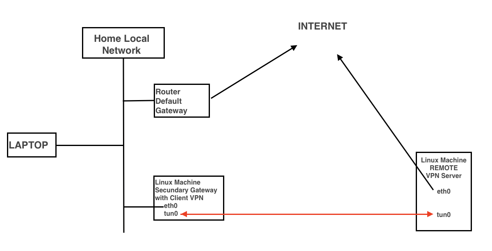

# home-vpn


To use the VPN route in any Local Network machine you only need to change the default gateway
   
MAC sample:
```
sudo route delete default
sudo route add default [Secundary-gateway-IP]
```
